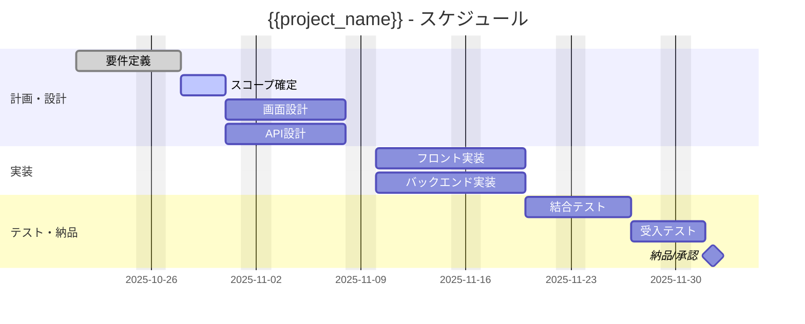

# name: スケジュール
# description: PMBOK第7版準拠のプロジェクトスケジュールを自動生成します

## 説明
このコマンドは **PMBOK第7版** に準拠したアプローチで、**プロジェクト・スケジュール（Schedule / 進行計画）** をMarkdownで自動生成します。  
タスク一覧、所要工数、依存関係、担当、開始・終了日、クリティカルパスの観点を網羅し、**表形式**と**Mermaidガントチャート**の2形式で出力します。

---

## プロンプトテンプレート

あなたはPMP（Project Management Professional）です。  
以下の入力情報をもとに、**PMBOK第7版準拠のプロジェクト・スケジュール**をMarkdownで作成してください。  
- 「表（タスク分解・担当・所要期間・開始/終了・依存関係・バッファ）」と「MermaidのGantt」を両方出力すること  
- 休日/稼働カレンダー、タイムゾーン（JST）を明記すること  
- クリティカルパス候補（依存関係上、遅延が全体遅延に直結する連鎖）をテキストで注記すること  
- ベースライン（初期計画）と現行計画に差異がある場合は差分欄を記載すること

### 入力変数
- `project_name`: プロジェクト名  
- `calendar`: 稼働カレンダー（例：平日稼働/土日祝休、国民の祝日除外 等）  
- `timezone`: タイムゾーン（例：Asia/Tokyo）  
- `start_date`: 計画開始日（YYYY-MM-DD）  
- `milestones`: 主要マイルストーン（名称と日付）  
- `tasks`: タスク一覧（WBS ID、名称、担当、所要期間（日/週）、依存関係（先行タスクID）、バッファ）  
- `baseline`: ベースライン（初期計画の主要日付）  
- `assumptions`: 前提条件（リソース可用性、外部レビューリードタイム等）  
- `risks_for_schedule`: スケジュール上の主要リスク（回避/低減策を含む）  
- `change_control`: スケジュール変更管理の流れ（承認権限・影響分析の手順）

---

## 出力仕様（例）

# **プロジェクト・スケジュール**
### プロジェクト名：{{project_name}}

**稼働カレンダー**：{{calendar}}  
**タイムゾーン**：{{timezone}}  
**計画開始日**：{{start_date}}

---

## 1. マイルストーン
| マイルストーン | 予定日 |
|---|---|
| {{milestones}} |

---

## 2. タスク一覧（表）
> 単位は「日（営業日）」を基本とする。依存関係は「先行タスクID」を列挙。

| WBS ID | タスク名 | 担当 | 期間 | 開始 | 終了 | 依存関係 | バッファ | クリティカル候補 | 差分（現行 vs ベースライン） |
|---|---|---|---|---|---|---|---|---|---|
| 1.1 | 要件定義 | PM/顧客 | 5d | 2025-10-21 | 2025-10-27 | - | 1d | ✅ | +1d（レビュー延長） |
| 1.2 | スコープ確定 | PM | 3d | 2025-10-28 | 2025-10-30 | 1.1 | 0d | ✅ | 0d |
| 2.1 | 画面設計 | UX | 6d | 2025-10-31 | 2025-11-07 | 1.2 | 1d | ✅ | -1d（並行化） |
| 2.2 | API設計 | BE | 6d | 2025-10-31 | 2025-11-07 | 1.2 | 0d | ✅ | 0d |
| 3.1 | フロント実装 | FE | 8d | 2025-11-10 | 2025-11-19 | 2.1,2.2 | 1d | ✅ | +2d（仕様追加） |
| 3.2 | バックエンド実装 | BE | 8d | 2025-11-10 | 2025-11-19 | 2.2 | 0d | ✅ | 0d |
| 4.1 | 結合テスト | QA | 5d | 2025-11-20 | 2025-11-26 | 3.1,3.2 | 1d | ✅ | +1d（欠陥対応） |
| 5.1 | 受入テスト | 顧客 | 3d | 2025-11-27 | 2025-12-01 | 4.1 | 0d | ✅ | 0d |
| 6.1 | 納品/承認 | PM/顧客 | 1d | 2025-12-02 | 2025-12-02 | 5.1 | 0d | ✅ | 0d |

> **クリティカルパス候補**：1.1 → 1.2 → 2.1/2.2 → 3.1/3.2 → 4.1 → 5.1 → 6.1

---

## 3. ガントチャート（Mermaid）


---

## 4. 前提条件 / 休暇・制約
{{assumptions}}

---

## 5. スケジュール上の主要リスクと対応
{{risks_for_schedule}}

---

## 6. 変更管理（スケジュール）
{{change_control}}

---

## 使用例

**Cursor上での実行例：**
```bash
/create_schedule_plan_ja
project_name: "AI-PM Nova PoC"
calendar: "平日稼働（土日祝休）/ 国民の祝日除外"
timezone: "Asia/Tokyo"
start_date: "2025-10-21"
milestones: "デモ(2025-11-10), 受入(2025-12-01), 納品(2025-12-02)"
tasks: |
  - 1.1 要件定義 / PM・顧客 / 5d / 依存:なし / バッファ:1d
  - 1.2 スコープ確定 / PM / 3d / 依存:1.1 / バッファ:0d
  - 2.1 画面設計 / UX / 6d / 依存:1.2 / バッファ:1d
  - 2.2 API設計 / BE / 6d / 依存:1.2 / バッファ:0d
  - 3.1 フロント実装 / FE / 8d / 依存:2.1,2.2 / バッファ:1d
  - 3.2 バックエンド実装 / BE / 8d / 依存:2.2 / バッファ:0d
  - 4.1 結合テスト / QA / 5d / 依存:3.1,3.2 / バッファ:1d
  - 5.1 受入テスト / 顧客 / 3d / 依存:4.1 / バッファ:0d
  - 6.1 納品/承認 / PM・顧客 / 1d / 依存:5.1 / バッファ:0d
baseline: "主要マイルストーン: デモ(11/10), 受入(12/01), 納品(12/02)"
assumptions: "XXX側レビュー2営業日、外部APIの制限を考慮、並行作業可能な範囲はPM判断で許可"
risks_for_schedule: "要件変更・依存API障害・レビュー遅延。対策: 変更凍結日設定、バックアップAPI、スプリント末レビュー固定。"
change_control: "変更申請→影響分析（期間/コスト/範囲）→PM承認→スポンサー承認→スケジュール更新→周知"
```

---

## 備考
- **PMBOK第7版**の「スケジュール・パフォーマンス領域」に準拠し、価値提供に直結する経路（クリティカルパス）を明確化。  
- MermaidガントはGitHub/Notion/Confluence等で視覚化が容易。  
- WBS、プロジェクトマネジメント計画書 と併用すると、初期計画セットを迅速に整備可能。
